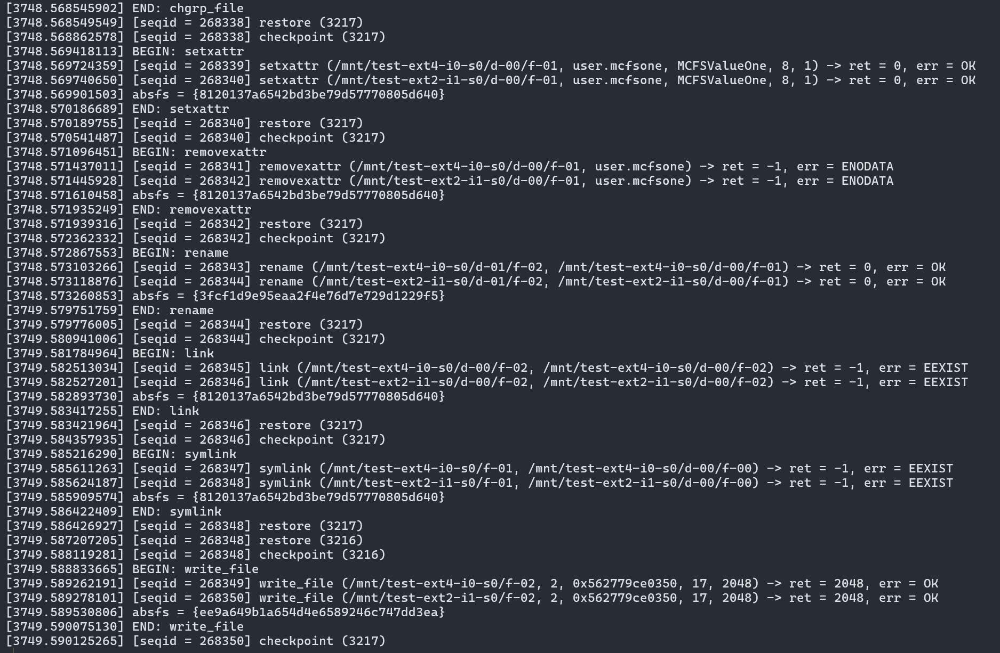

# Metis/RefFS Fuzzing工具

## 编译安装Metis和RefFS

需要先在Github上设置好ssh key，方便脚本的自动同步代码。具体设置方法是把本机的`~/.ssh/id_rsa.pub`公钥中的内容，复制到Github的`https://github.com/settings/ssh/new`中，以添加一个新的ssh key.

### 编译安装`Metis`

同步代码仓库

```
git clone git@github.com:sbu-fsl/Metis.git
```

安装依赖
```
sudo apt-get install python3-pip
sudo pip3 install numpy scipy matplotlib

cd ~/Metis/scripts
./setup-deps.sh
```

编译并安装到系统

```
cd ~/Metis
make 
make install #会申请sudo权限安装库到系统中
```

### 编译安装`RefFS`

依赖`Metis`和`libfuse`等

```
git clone git@github.com:sbu-fsl/RefFS.git

cd RefFS
mkdir build
cd build
cmake ../src
make
sudo make install
sudo mkdir -p /mnt/test-verifs2
sudo mount -t fuse.fuse-cpp-ramfs verifs2 /mnt/test-verifs2
```
以上步骤或者可以直接执行自动编译安装脚本：`./setup_verifs2.sh`.

若编译与安装正确，则在执行`mount`命令时，会有如下挂载条目显示：


卸载RefFS/VeriFS2文件系统命令则是：`sudo umount /mnt/test-verifs2`

## Metis运行
### 简单的Metis运行
这里 Ext4 作为参考文件系统，Ext2 是被测试的文件系统。

```
cd ~/Metis/fs-state/mcfs_scripts/
sudo ./single_ext2.sh

# 停止运行检查
# sudo fs-state/stop.sh
```

若要结束文件系统的检查，则运行`sudo fs-state/stop.sh`来停止。

脚本`single_ext2.sh`会加载需要的内核模块，然后通过运行 `fs-state/setup.sh`脚本, 运行具有单一验证任务 (VT) 的 Metis. 在执行setup.sh之前，需要确保文件系统的测试设备已经创建，并且它们的设备类型/大小与提供给setup.sh的参数匹配。如 `fs-state/setup.sh -f ext4:$EXT4_SZKB:ext2:$EXT2_SZKB`。创建好设备，以及ext4和ext2文件系统。

运行文件系统检查是，标准输出存放于文件 `output*.log`, 错误输出存放于文件`error*.log`. 清理日志可以 
```
cd fs-state
sudo make clean
```
此实验将持续运行，直到遇到两个文件系统之间的差异，即潜在的bug. `output-pan*.log` 记录时间戳、已执行的操作以及每个操作的参数和结果，以及输出抽象状态。 `error-pan*.log` 记录模型检查器遇到的测试文件系统之间的行为差异。 如果没有发现差异，`error-pan*.log` 应该为空。



## RefFS - 通过对比RefFS以验证Ext4 
创建一个新的`RefFS`作为`Metis`的参考文件系统

运行RefFS与Ext4的对比检查：
```
cd ~/Metis/fs-state/mcfs_scripts/
sudo ./single_verifs2.sh

# 停止运行检查
# sudo fs-state/stop.sh
```
请检查fs-state目录下的日志log。

检查文件`error-pan*.log`，看是否找到bug

## 使用Metis重放

重复是通过解析log文件`sequence-pan-xx.log`和`dump_prepopulate_xx.log`来实现的。
Metis重放器逐行解析log文件，读取操作/参数，并在单个或两个文件系统（由重放器参数列表指定）上执行精确的操作（包括状态保存/恢复）。

所有，先修改文件`fs-state/replay.c`的40和46行，这两个log文件的名称要正确。

### 编译重放程序并运行

可以使用 replayer 程序来重放准确的操作序列，以调试/重现 出现的 差异/错误 或获取 Metis 运行期间的任何中间文件系统状态。

以检查Ext2对比Ext4为例。

```
cd ~/Metis/fs-state/
# 先修改正确replay.c文件中的log文件名称
sudo make replayer
# Load ramdisk devices for replaying Ext4 vs. Ext2
sudo ./loadmods.sh

# 运行重放
sudo ./replay -K 0:ext4:256:ext2:256
```
运行参数如`VTid:FS1:SIZE1:FS2:SIZE2`, 将打印文件系统的执行操作情况。

## 多进程并行的Swarm验证

通过`Swarm Verification`并行运行多进程

```
cd ~/Metis/fs-state/
# 配置文件swarm.lib
yes | sudo sh -c 'cp -f swarm-single-node.lib swarm.lib'
# 清理之前的log，卸载之前的文件系统
sudo make clean
sudo umount /dev/ram*
# 移除所有ramdisk设备
sudo rmmod brd

# 重新加ramdisk设备，以使用Swarm检查Ext2 vs Ext4
sudo ./loadmods.sh
# Test Ext4 vs. Ext2 with 6 个验证任务(VTs)
sudo ./setup_swarm.sh -f ext4:256:ext2:256 -n 6

# 运行swarm
sudo ./mcfs-main.pml.swarm 

# 结束所有的验证任务
# stop.sh
```
这将运行多个VT验证任务，每个VT通过各种多样化技术，探索状态空间的不同部分。
应该确认VT的数量应等于或小于CPU核心的总数。

## 论文的试验结果

论文中的实验结果。通过目录`Metis/ae-experiments`中的脚本，来运行实验和收集数据。

